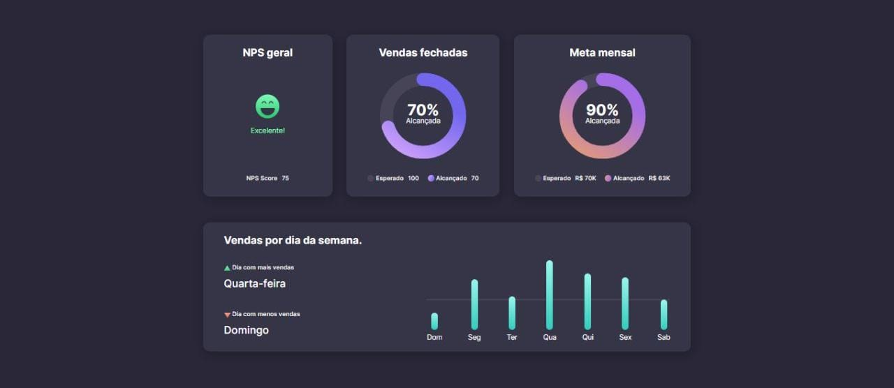
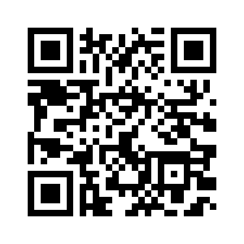

# AivanSales

O projeto AivanSales, teve seu desenvolvimento atrás de um evento semanal fornecido pela Rocketseat, o evento #BoraCodar.

O projeto foi desenvolvido com o objetivo de ajudar empresas, empresários, empreendedores a controlar suas vendas mensais e metas estabelecidas por venda, tendo também um gráfico que ajuda a ver qual dia teve mais vendas e dia de menos vendas

## Demonstração

## 💻 Tech Stack:
  
  
 

## Material

https://www.figma.com/community/file/1210217615683203825/%23boraCodar---Desafio-8

## Licença

[MIT License](https://choosealicense.com/licenses/mit/)

## Suporte

Para suporte, mande um email para ivan.rocha.0987@gmail.com ou entre em contato via whatsapp (41) 98468-5317.

## Feedback

Se você tiver algum feedback, por favor enviar para ivan.rocha.0987@gmail.com

## Autores

- [@IvanRocha](https://www.github.com/ivanrocha10)
- [@Rocketseat](https://github.com/Rocketseat)

## Projeto

  Acesse o "AivanSales" pelo QR:

  

Caso o QR não funcione, acesse <a href="https://ivanrocha10.github.io/AivanSales/">aqui</a>

